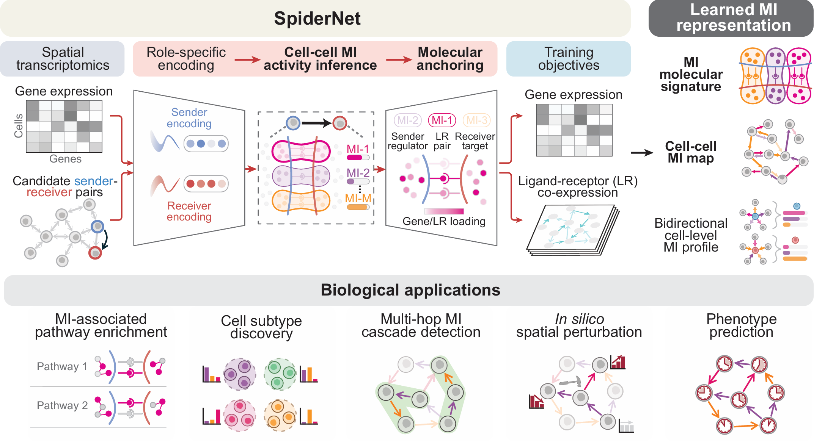

# SpiderNet

**A meta-interaction basis for cell-cell communication in tissues**

## Overview



SpiderNet is an interpretable deep learning framework for learning directional cell-cell meta-interactions (MIs) from spatial omics data.

SpiderNet takes gene expression profiles and a spatial cell-cell graph as input. For each directed neighboring cell pair, the encoder maps sender and receiver expression into a non-negative vector of MI strengths. The decoder uses these MIs to reconstruct ligand-receptor co-expression on cell-cell pairs and gene expression in cells. The non-negative model components make the learned MIs interpretable through intrinsic, ligand-receptor, sender-regulator, and receiver-target gene loadings.

The inferred MIs provide a compact representation of multicellular communication programs, supporting MI-associated pathway inference, cell-type-pair enrichment, cell subtype discovery, MI cascade detection, in silico spatial perturbation, and phenotype prediction.

This repository provides the Python package, eight study workflows, and the SpiderNet-Interactive application. Prepared data and saved results are distributed separately through Zenodo.

---

## Installation

SpiderNet requires Python 3.11. We recommend creating a clean conda environment:

```bash
conda create -n SpiderNet_env python=3.11.8
conda activate SpiderNet_env
```

### 1. Install PyTorch and PyTorch Geometric

Install PyTorch and PyG before SpiderNet. Their installation depends on the operating system and CPU/CUDA environment. The recorded CUDA 11.7 setup uses:

```bash
pip install torch==2.0.0 torchvision==0.15.1 --index-url https://download.pytorch.org/whl/cu117
pip install torch-geometric==2.7.0
pip install torch-scatter torch-sparse -f https://data.pyg.org/whl/torch-2.0.0+cu117.html
```

For a different CUDA version or a CPU-only environment, install the matching [PyTorch](https://pytorch.org/get-started/previous-versions/) and [PyG](https://pytorch-geometric.readthedocs.io/en/latest/install/installation.html) builds. Saved data and checkpoints also need compatible library versions; see the [reproduction instructions](docs/REPRODUCIBILITY.md).

### 2. Install SpiderNet

Clone the repository and install from its root:

```bash
git clone https://github.com/ma-compbio-lab/SpiderNet.git
cd SpiderNet
pip install .
```

For development or running the repository workflows, use editable installation:

```bash
pip install -e .
```

The installable source is under `SpiderNet/SpiderNet/`; the root `pyproject.toml` locates it automatically. The Python package can be installed without downloading study data.

### 3. Install optional dependencies

Install the dependencies needed for the workflows you intend to run:

```bash
# Notebook and tutorial dependencies
pip install -r requirements-tutorial.txt

# Interactive application dependencies
python -m pip install -r .\requirements-UI.txt

# Optional external-method benchmark dependencies
pip install -r requirements-benchmark.txt
```

Some R/R Markdown analyses require separate R packages; see [R requirements](Tutorial/R_requirements.md) and the relevant study README. `requirements-full-freeze.txt` records a development environment and is not a portable installation recipe for every operating system.

For Jupyter, register the environment as a notebook kernel:

```bash
python -m ipykernel install --user --name SpiderNet_env --display-name "Python (SpiderNet_env)"
```

---

## Verify installation

Check the package, deep-learning dependencies, and packaged ligand-receptor resources:

```bash
python -c "import SpiderNet; print(SpiderNet.__file__)"
python -c "import torch; print(torch.__version__, torch.cuda.is_available())"
python -c "import torch_geometric, torch_scatter, torch_sparse; print('PyG OK')"
python -c "from SpiderNet.utils import get_default_cellchat_db; print(get_default_cellchat_db('human'))"
```

---

## Basic usage

A typical SpiderNet workflow consists of preparing spatial omics data and a spatial cell-cell graph, training the model, inferring MI strengths for directed neighboring cell pairs, and performing downstream analyses.

The example below illustrates the training API using an existing processed-data bundle. Set the paths and training configuration for your dataset. For reproducing saved-result figures, go directly to [Reproduce the study results](#reproduce-the-study-results).

```python
from pathlib import Path

from SpiderNet.config import TrainingConfig
from SpiderNet.io import load_processed_data
from SpiderNet.api import (
    build_model,
    run_training,
    infer_meta_interactions,
    normalize_outputs,
    export_results,
)

processed_data_dir = Path("path/to/ProcessedData")
output_dir = Path("path/to/SpiderNet_Result_dim15")

processed = load_processed_data(processed_data_dir)
training_config = TrainingConfig(
    dim_envir=15,
    max_epoch=50000,
    n_jobs=5,
    optimizer="adam",
)

model = build_model(processed, training_config)
trained_model = run_training(
    model=model,
    processed=processed,
    train_cfg=training_config,
    model_dir=output_dir / "Model",
)

outputs = infer_meta_interactions(trained_model, processed)
outputs = normalize_outputs(outputs)
export_results(
    results=outputs,
    processed=processed,
    precessed_data_dir=processed_data_dir,
    output_dir=output_dir,
)
```

The `precessed_data_dir` keyword follows the current public API spelling. Dataset-specific preprocessing, MI dimension selection, and analysis settings are described in the study notebooks and READMEs.

---

## Tutorials and studies

All study workflows are in `Tutorial/`. Each study provides a README and a `run_benchmarks.py` command-line entry point alongside its analysis notebooks or helper scripts.

| Study | Analyses | Data profile |
|---|---|---|
| [AgingBrain](Tutorial/AgingBrain/README.md) | Age-associated cell interactions, spatial MI patterns, and transfer to sagittal/hippocampal samples | `plot-agingbrain` |
| [HGSOC](Tutorial/HGSOC/README.md) | Malignant subtypes, CAF signaling, MI cascades, and cell-cell communication comparisons | `plot-hgsoc` |
| [PerturbFISH](Tutorial/PerturbFISH/README.md) | Perturbation responses, held-out predictions, and spatial perturbation analyses | `plot-perturbfish` |
| [Pancancer](Tutorial/Pancancer/README.md) | Cross-cancer MI patterns, cascades, bulk projection, survival, and immunotherapy associations | `plot-pancancer` |
| [Simulation](Tutorial/Simulation/README.md) | Synthetic-data benchmarks and a representative spatial-interaction example | `plot-simulation` |
| [Coupling benchmark](Tutorial/Coupling_benchmark/README.md) | Directionality, cell-similarity concordance, and spatial specificity | `plot-coupling-benchmark` |
| [Ablation study](Tutorial/Ablation_study/README.md) | Contributions of model components to coupling and perturbation prediction | `plot-ablation-study` |
| [Robustness and stability](Tutorial/Robustness_stability/README.md) | MI alignment, annotation errors, resampling, and stability analyses | `plot-robustness-stability` |

See the [study guide](docs/STUDIES.md) for how these workflows connect to model outputs and the [training benchmark](benchmarks/training_speed/BENCHMARK_RESULTS.md) for optional implementation-performance comparisons.

## Data availability

The data supporting the documented SpiderNet reproduction workflows have been uploaded to Zenodo and are currently shared privately for peer review. Editors and reviewers can access the files through the private link supplied in the review manuscript and journal submission materials. The dataset will be made publicly available upon publication of the paper; the dataset DOI and public download links will then be added here and to `data/manifest.json`.

The data collection contains saved results, plotting inputs, interactive datasets, detailed result tables, and training-benchmark outputs. The [data guide](docs/DATA.md) lists the bundles, sizes, and workflow profiles. The manifest records archive and file-level SHA-256 checksums and restoration paths.

## Reproduce the study results

During peer review, download the ZIP archives using the supplied reviewer link and keep their filenames unchanged. From the repository root, list the required bundles and restore one study:

```bash
python scripts/data.py list

# Replace /path/to/archives with the folder containing the downloaded ZIPs.
python scripts/data.py restore --profile plot-agingbrain --archive-dir /path/to/archives
python scripts/data.py verify --profile plot-agingbrain

# Check the required inputs before rendering the saved-result figures.
python scripts/run_study.py AgingBrain --check --plot-only
python scripts/run_study.py AgingBrain --plot-only
```

To restore all eight default plot-only workflows, use `--profile all-plots` with `restore` and `verify`. Use the restore tool rather than manually extracting ZIPs: identical archived content may need to be placed at multiple workflow paths. Existing identical files are preserved; different existing data are not overwritten by default.

The original study commands remain available after activating the reproduction paths. In PowerShell, from the repository root:

```powershell
. ./scripts/activate_reproduction.ps1
cd Tutorial/AgingBrain
python run_benchmarks.py --check --plot-only
python run_benchmarks.py --plot-only
```

In Bash, use `source scripts/activate_reproduction.sh` before entering the study folder. These helpers point the workflows to data restored inside this checkout. See [reproduction instructions](docs/REPRODUCIBILITY.md) for details.

Automated `python scripts/data.py fetch --profile plot-agingbrain` downloads will become available when public Zenodo URLs are configured.

**Reproduction scope.** These profiles support the documented default saved-result plotting workflows. Some steps redraw figures from saved numerical inputs; others retain archived figures. The Simulation profile includes a representative saved experiment. The archives are not a complete raw-data training collection for every analysis or external comparator. Full analysis and retraining require the inputs and settings described in each study README. Direct notebook execution may require its own path overrides. `--check` validates declared inputs and relevant cache signatures; it does not perform a complete numerical reproduction or render all figures.

---

## SpiderNet-Interactive

SpiderNet-Interactive is a local Flask application for exploring trained SpiderNet runs in a browser. Four modules connect saved model outputs to interactive analyses:

| Module | Purpose |
|---|---|
| **M1: Basic analysis** | Spatial MI activity, ligand-receptor and sender/receiver loadings, pathways, and cell-type-pair enrichment |
| **M2: Subtype discovery** | MI-guided cell clustering, differential expression, and GO/KEGG enrichment |
| **M3: MI cascades** | Permutation-tested MI cascades, cell-type triplets, spatial displays, and associated gene programs |
| **M4: Spatial perturbation** | In silico gene knockdown or cell-type replacement using the trained model |

From the repository root, install the UI dependencies and restore the interactive data profile:

```bash
pip install -r SpiderNet/requirements-UI.txt
python scripts/data.py restore --profile interactive --archive-dir /path/to/archives
cd SpiderNet/SpiderNet-interactive
python app.py
```

Open **http://localhost:8000**. The application discovers prepared `_UI` datasets under `SpiderNet/Interactivetool/SpiderNet-interactive_V2/`; restart after adding a dataset. Analyses use saved data and caches, while some requests compute additional results or run inference. See the [application guide](SpiderNet/SpiderNet-interactive/README.md) for dataset requirements, caching, and configuration.

---

## Main modules and package resources

| Module | Purpose |
|---|---|
| `SpiderNet.config` | Configuration for paths, preprocessing, and training |
| `SpiderNet.io` | Loading and saving processed data |
| `SpiderNet.api` | Model construction, training, inference, normalization, and export |
| `SpiderNet.model` | Model architecture |
| `SpiderNet.analysis` | MI enrichment, cascades, perturbation, and phenotype-related analyses |
| `SpiderNet.visualization` | Visualization utilities |
| `SpiderNet.MI_dimension_selection` | MI dimension selection |
| `SpiderNet.dataloading_unified` | Data loading and preprocessing |
| `SpiderNet.utils` | Utilities and default ligand-receptor resource paths |

Four human/mouse ligand-receptor tables derived from CellChatDB and scSeqComm are included under `SpiderNet/SpiderNet/resources/` and installed with the package. Access them with:

```python
from SpiderNet.utils import get_default_cellchat_db, get_default_scseqcomm_db

cellchat_human = get_default_cellchat_db("human")
scseqcomm_human = get_default_scseqcomm_db("human")
```

## Repository structure

```text
SpiderNet/
  SpiderNet/                Python package and ligand-receptor resources
  SpiderNet-interactive/    Flask application and static assets
Tutorial/                  Eight study workflows and documentation
benchmarks/training_speed/ Optional training-performance benchmarks
data/                      Archive manifest and data instructions
scripts/                   Data restoration and study launch utilities
docs/                      Study, data, and reproduction guides
pyproject.toml             Package installation configuration
```

Large datasets, trained-run bundles, and complete result collections are distributed separately from Git. Restored data are ignored by Git.

## Citation

If you use SpiderNet, please cite the corresponding manuscript, *SpiderNet: A meta-interaction basis for cell-cell communication in tissues*. The manuscript citation and public dataset DOI will be added when available.

## License

The source code is distributed under the [MIT License](LICENSE). Data and third-party resources are subject to their respective licenses and attribution requirements.
